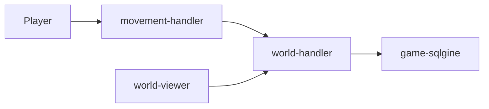

As some youtuber once said: 'Anything is a game engine, if you try hard enough'. You can wathc the video I am talking about [here](https://www.youtube.com/watch?v=djIufZ7Fyms).

I am doing this project to further prove this statement. The game engine I've choosen is SQL database. I am trying to learn stuff in a meantime (mainly golang and developing a microservice based solution that can be deployed on a kubernetes cluster).

The basic idea looks like this:

Each of the elements from the diagram (expect Player) is going to be developed as a microservice that I am going to deploy on my minikube environment. Each of the microservice will have it's own README file and (hopefully) some docs.
